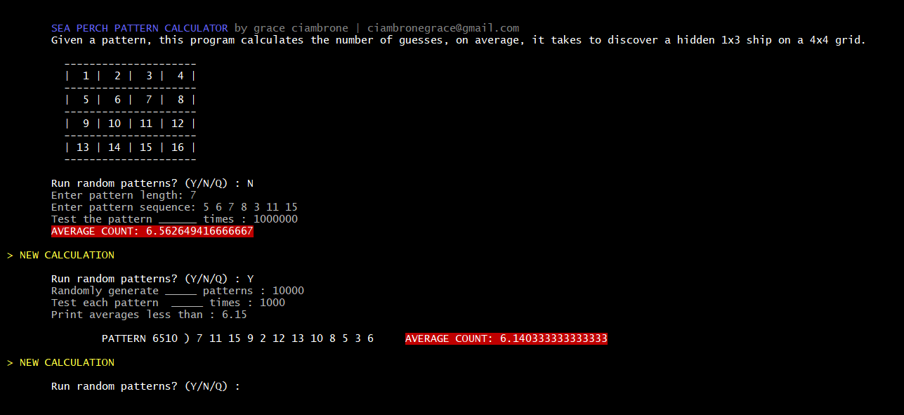

# Pattern Output Calculator

Given a guessing pattern provided by the user, this program
* calculates the average number of guesses it takes to discover a hidden 1x3 "ship" on a 4x4 grid
* searches for the most efficient guessing pattern possible

This project was developed for a 2019 underwater robotics competition called SeaPerch.  This program helped our team place 3rd internationally.
